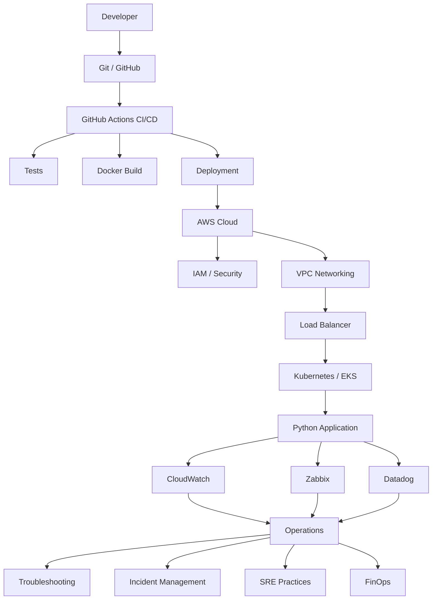

# AWS Cloud, DevOps & SRE Operations Lab

A hands-on engineering laboratory focused on Cloud, DevOps, Site Reliability Engineering, Monitoring, Observability, Infrastructure Automation, Incident Management and FinOps using AWS and modern infrastructure tooling.

This repository is designed as an end-to-end operational environment where infrastructure is built, deployed, monitored, intentionally broken, investigated and improved.

---

## Project Objectives

The main objective of this repository is to develop practical experience across the complete lifecycle of modern cloud infrastructure operations.

The project covers:

- AWS Cloud Infrastructure
- Linux Administration
- Terraform / Infrastructure as Code
- Docker
- Kubernetes
- Git and GitHub
- GitHub Actions
- CI/CD
- Python
- Bash
- AWS Networking
- IAM and Cloud Security
- Monitoring with Zabbix
- Monitoring with Amazon CloudWatch
- Observability with Datadog
- Troubleshooting
- Incident Management
- Root Cause Analysis
- Runbooks
- SLI, SLO and reliability concepts
- FinOps
- Production incident simulations

---

## Architecture Evolution

The platform will evolve incrementally throughout the laboratory.


---

## Repository Structure

```markdown
aws-cloud-devops-sre-operations-lab/
│
├── README.md
├── LICENSE
├── .gitignore
├── ROADMAP.md
├── CHANGELOG.md
├── CONTRIBUTING.md
│
├── docs/
│   ├── architecture/
│   │
│   ├── getting-started/
│   │
│   ├── stages/
│   │   └── 00-workstation-repository/
│   │
│   ├── aws/
│   ├── linux/
│   ├── terraform/
│   ├── docker/
│   ├── kubernetes/
│   ├── ci-cd/
│   │
│   ├── monitoring/
│   │   ├── zabbix/
│   │   └── cloudwatch/
│   │
│   ├── observability/
│   │   └── datadog/
│   │
│   ├── troubleshooting/
│   ├── incidents/
│   ├── runbooks/
│   ├── finops/
│   └── security/
│
├── scripts/
│   ├── bash/
│   └── python/
│
├── terraform/
│   ├── modules/
│   └── envs/
│       ├── dev/
│       └── prod/
│
├── docker/
│
├── kubernetes/
│   ├── base/
│   ├── overlays/
│   │   ├── dev/
│   │   └── prod/
│   └── helm/
│
├── apps/
│   └── python-service/
│       ├── app/
│       ├── tests/
│       ├── requirements.txt
│       ├── Dockerfile
│       └── README.md
│
├── .github/
│   └── workflows/
│
├── images/
│
└── .vscode/
```
---

## Laboratory Roadmap

| Stage | Topic                               | Status      |
| :-----: | ----------------------------------- | ----------- |
| 00    | Workstation & Repository            | In Progress |
| 01    | AWS Foundation                      | Planned     |
| 02    | Terraform Foundation                | Planned     |
| 03    | Linux Operations                    | Planned     |
| 04    | Python Workload                     | Planned     |
| 05    | Docker                              | Planned     |
| 06    | Kubernetes                          | Planned     |
| 07    | CI/CD with GitHub Actions           | Planned     |
| 08    | Monitoring with Zabbix & CloudWatch | Planned     |
| 09    | Observability with Datadog          | Planned     |
| 10    | SRE Operations                      | Planned     |
| 11    | FinOps & Security                   | Planned     |
| 12    | Production Incident Labs            | Planned     |


---

## Technology Stack

### Cloud

- Amazon Web Services
- Amazon EC2
- Amazon VPC
- IAM
- Amazon CloudWatch
- Elastic Load Balancing
- Amazon ECR
- Amazon EKS

### Infrastructure as Code

- Terraform

### Containers

- Docker
- Kubernetes

### CI/CD

- Git
- GitHub
- GitHub Actions

### Automation

- Bash
- Python

### Monitoring

- Amazon CloudWatch
- Zabbix

### Observability

- Datadog

### Operations

- Linux
- Troubleshooting
- Incident Management
- Root Cause Analysis
- Runbooks
- SLI / SLO
- FinOps


---

## 📈 Repository Metrics

<p align="center">
  <a href="http://s01.flagcounter.com/more/058">
    
  </a>
</p>

