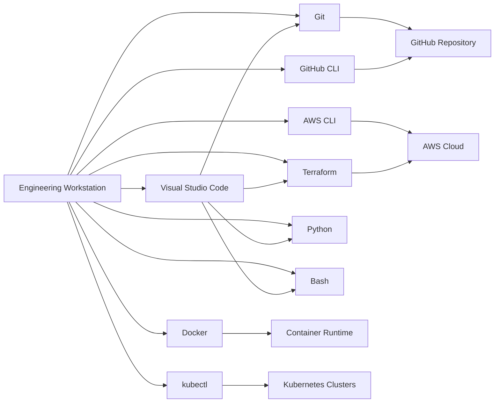
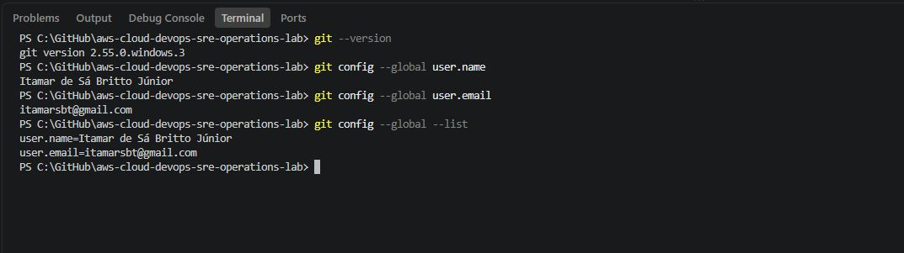
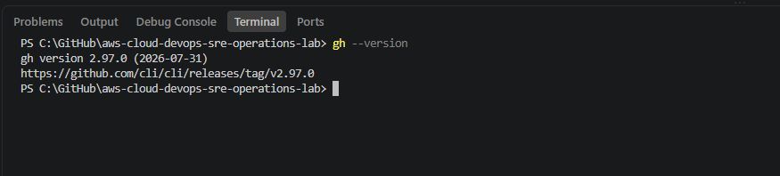
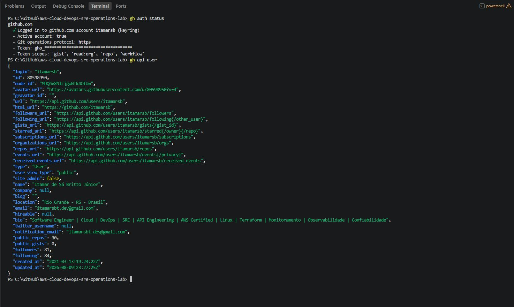
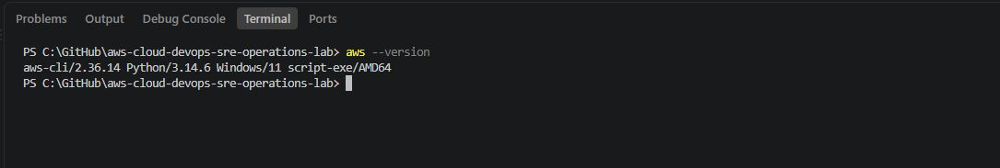

# Stage 00 — Workstation & Repository Validation

## AWS Cloud, DevOps & SRE Operations Lab

> **Stage 00** establishes and validates the local engineering workstation used throughout the entire repository.

Before provisioning cloud infrastructure, building CI/CD pipelines, deploying containers, configuring Kubernetes, or implementing monitoring and observability, the local workstation must provide a reliable and reproducible engineering environment.

This stage validates the tools, authentication mechanisms, shell environment, repository workflow, and command-line utilities required by the upcoming labs.

---

## Table of Contents

* [Objective](#objective)
* [Architecture](#architecture)
* [Tools and Technologies](#tools-and-technologies)
* [Stage Goals](#stage-goals)
* [Prerequisites](#prerequisites)
* [Step 1 — Git Validation](#step-1--git-validation)
* [Step 2 — GitHub CLI Validation](#step-2--github-cli-validation)
* [Step 3 — GitHub Authentication](#step-3--github-authentication)
* [Step 4 — AWS CLI Validation](#step-4--aws-cli-validation)
* [Step 5 — AWS Authentication Validation](#step-5--aws-authentication-validation)
* [Step 6 — Terraform Validation](#step-6--terraform-validation)
* [Step 7 — Docker Validation](#step-7--docker-validation)
* [Step 8 — Kubernetes CLI Validation](#step-8--kubernetes-cli-validation)
* [Step 9 — Python Validation](#step-9--python-validation)
* [Step 10 — Bash Validation](#step-10--bash-validation)
* [Step 11 — Visual Studio Code Validation](#step-11--visual-studio-code-validation)
* [Step 12 — Repository Validation](#step-12--repository-validation)
* [Step 13 — Git Workflow Validation](#step-13--git-workflow-validation)
* [Final Validation](#final-validation)
* [Security Best Practices](#security-best-practices)
* [Troubleshooting](#troubleshooting)
* [Evidence Checklist](#evidence-checklist)
* [Key Learnings](#key-learnings)
* [Next Stage](#next-stage)

---

# Objective

Prepare and validate the engineering workstation required for the **AWS Cloud, DevOps & SRE Operations Lab**.

This stage establishes the local development environment, command-line tools, authentication mechanisms, Git workflow, and repository structure used throughout all subsequent stages.

The goal is not only to verify that each tool is installed, but also to confirm that the workstation can interact correctly with:

* GitHub
* AWS
* Terraform
* Docker
* Kubernetes
* Python
* Bash
* Visual Studio Code

---

# Architecture

The workstation acts as the engineering control plane for the environments developed throughout this repository.



### Engineering Workflow

```text
Engineer
   │
   ▼
Visual Studio Code
   │
   ├── Git / GitHub CLI ───────► GitHub
   │
   ├── AWS CLI ────────────────► AWS
   │
   ├── Terraform ──────────────► Infrastructure as Code
   │
   ├── Docker ─────────────────► Containers
   │
   ├── kubectl ────────────────► Kubernetes
   │
   ├── Python ─────────────────► Automation
   │
   └── Bash ───────────────────► Operations & Automation
```

---

# Tools and Technologies

The following tools are required and validated during this stage:

| Tool               | Primary Purpose                 |
| ------------------ | ------------------------------- |
| Git                | Source control                  |
| GitHub CLI         | GitHub command-line operations  |
| AWS CLI            | AWS command-line administration |
| Terraform          | Infrastructure as Code          |
| Docker             | Container management            |
| kubectl            | Kubernetes administration       |
| Python 3           | Automation and scripting        |
| Bash               | Shell scripting and operations  |
| Visual Studio Code | Primary development environment |

Optional Linux utilities:

* `curl`
* `wget`
* `jq`
* `tree`
* `unzip`

---

# Stage Goals

By the end of this stage, the workstation must be able to:

* Clone and update GitHub repositories
* Authenticate securely with GitHub
* Authenticate with AWS
* Execute AWS CLI commands
* Execute Terraform commands
* Build and run Docker containers
* Execute Kubernetes CLI commands
* Run Python scripts
* Run Bash scripts
* Work with the repository through Visual Studio Code
* Commit changes locally
* Push changes to GitHub

---

# Prerequisites

Before starting this stage, verify that you have:

* A GitHub account
* An AWS account or authorized AWS environment
* Internet connectivity
* Local administrative permissions when required
* Visual Studio Code installed
* Access to a terminal environment

> [!IMPORTANT]
> Never store AWS credentials, GitHub tokens, private keys, passwords, `.env` files containing secrets, or other sensitive credentials inside the repository.

---

# Step 1 — Git Validation

Git provides the source-control foundation for the entire repository.

Run:

```bash
git --version
```

Expected result:

```text
git version 2.x.x
```

Verify the Git configuration:

```bash
git config --global user.name
git config --global user.email
```

You can also inspect the complete global configuration:

```bash
git config --global --list
```

## Validation

Successful validation confirms that:

* Git is installed
* Git is available through the terminal
* User identity is configured





---

# Step 2 — GitHub CLI Validation

GitHub CLI provides command-line integration with GitHub.

Run:

```bash
gh --version
```

Expected result:

```text
gh version 2.x.x
```

## Validation

Confirm that the `gh` command is available.





---

# Step 3 — GitHub Authentication

Check the current GitHub authentication status:

```bash
gh auth status
```

A successful result should identify the authenticated GitHub account and the Git protocol being used.

If authentication has not yet been configured, run:

```bash
gh auth login
```

Follow the interactive authentication process.

After authentication, validate again:

```bash
gh auth status
```

You can also test API connectivity:

```bash
gh api user
```

## Security Note

Do **not** expose authentication tokens in screenshots.

Review the terminal output carefully before publishing evidence.





---

# Step 4 — AWS CLI Validation

Validate the AWS CLI installation:

```bash
aws --version
```

Expected output will contain the installed AWS CLI version.

Example:

```text
aws-cli/2.x.x
```

## Validation

This confirms that the AWS CLI executable is available from the terminal.





---

# Step 5 — AWS Authentication Validation

The preferred authentication mechanism depends on the AWS environment being used.

Possible approaches include:

* AWS IAM Identity Center
* Temporary credentials
* AWS CLI profiles
* IAM roles
* Other organization-approved authentication mechanisms

> [!NOTE]
> Long-lived IAM user access keys should not be treated as the default authentication strategy for modern production environments.

Check the configured AWS profiles:

```bash
aws configure list-profiles
```

Check the active configuration:

```bash
aws configure list
```

Then validate the current AWS identity:

```bash
aws sts get-caller-identity
```

A successful response should return information similar to:

```json
{
    "UserId": "...",
    "Account": "...",
    "Arn": "..."
}
```

## Security Warning

Before publishing screenshots:

* Hide or blur the AWS Account ID if desired
* Do not expose access keys
* Do not expose secret access keys
* Do not expose session tokens
* Do not expose sensitive organization information

## Validation

Successful execution of:

```bash
aws sts get-caller-identity
```

confirms that the workstation can authenticate with AWS.

## Evidence

```text
images/
└── step-05-aws-authentication.png
```

### Screenshot


---

# Step 6 — Terraform Validation

Terraform will be used for Infrastructure as Code throughout later stages.

Run:

```bash
terraform version
```

Expected output:

```text
Terraform v1.x.x
```

Optionally inspect available commands:

```bash
terraform -help
```

## Validation

Confirm that:

* Terraform is installed
* The executable is available through the terminal
* Terraform can initialize normally when used in later stages

## Evidence

```text
images/
└── step-06-terraform-validation.png
```

### Screenshot


---

# Step 7 — Docker Validation

Validate the Docker CLI:

```bash
docker --version
```

Check the Docker runtime:

```bash
docker info
```

Then perform a functional container test:

```bash
docker run --rm hello-world
```

The command should download the test image if necessary, create a container, execute it, display the Docker confirmation message, and remove the container automatically.

Check running containers:

```bash
docker ps
```

## Validation

This test validates more than the Docker CLI.

It confirms communication between:

```text
Docker CLI
     │
     ▼
Docker Engine
     │
     ▼
Container
```

## Evidence

```text
images/
└── step-07-docker-validation.png
```

### Screenshot


---

# Step 8 — Kubernetes CLI Validation

Validate `kubectl`:

```bash
kubectl version --client
```

Additional client information can be obtained with:

```bash
kubectl version --client --output=yaml
```

> [!NOTE]
> A Kubernetes cluster is not required for the basic client validation performed in this stage.

If no cluster is configured, commands such as:

```bash
kubectl get nodes
```

may fail.

That does not necessarily indicate a problem with the `kubectl` installation.

## Validation

The primary Stage 00 requirement is successful execution of:

```bash
kubectl version --client
```

## Evidence

```text
images/
└── step-08-kubectl-validation.png
```

### Screenshot


---

# Step 9 — Python Validation

Validate Python:

```bash
python --version
```

Depending on the operating system:

```bash
python3 --version
```

Validate `pip`:

```bash
python -m pip --version
```

or:

```bash
python3 -m pip --version
```

Perform a simple execution test:

```bash
python -c "print('Python environment validated successfully')"
```

Expected result:

```text
Python environment validated successfully
```

## Evidence

```text
images/
└── step-09-python-validation.png
```

### Screenshot


---

# Step 10 — Bash Validation

Validate Bash:

```bash
bash --version
```

Run a simple shell command:

```bash
bash -c 'echo "Bash environment validated successfully"'
```

Expected result:

```text
Bash environment validated successfully
```

## Windows Environments

On Windows, Bash may be provided through environments such as:

* Git Bash
* Windows Subsystem for Linux
* Other compatible shell environments

The exact environment used by later labs should be documented whenever shell behavior may differ.

## Evidence

```text
images/
└── step-10-bash-validation.png
```

### Screenshot


---

# Step 11 — Visual Studio Code Validation

Validate Visual Studio Code from the terminal:

```bash
code --version
```

Then open the current repository:

```bash
code .
```

Verify that:

* The repository opens correctly
* Git integration recognizes the repository
* The integrated terminal works
* Repository files are visible
* Source Control is available

Useful extensions for later stages may include support for:

* Terraform
* Python
* Docker
* Kubernetes
* YAML
* GitHub Actions

Extensions should be installed according to the requirements of each stage rather than adding unnecessary dependencies to the workstation.

## Evidence

```text
images/
└── step-11-vscode-validation.png
```

### Screenshot


---

# Step 12 — Repository Validation

Navigate to the repository root.

Check the current directory.

### Bash

```bash
pwd
```

### PowerShell

```powershell
Get-Location
```

Inspect the repository structure.

If `tree` is available:

```bash
tree
```

Or:

```bash
tree -L 3
```

On Windows:

```powershell
tree /F
```

Verify Git repository status:

```bash
git status
```

Inspect the configured remote:

```bash
git remote -v
```

Expected remote structure:

```text
origin  https://github.com/<username>/aws-cloud-devops-sre-operations-lab.git
```

or the corresponding SSH remote.

## Validation

Confirm that:

* The local repository exists
* Git recognizes the repository
* The correct GitHub remote is configured
* The repository structure is accessible

## Evidence

```text
images/
└── step-12-repository-validation.png
```

### Screenshot


---

# Step 13 — Git Workflow Validation

The final workstation test validates the local-to-remote Git workflow.

Check repository status:

```bash
git status
```

Synchronize remote information:

```bash
git fetch origin
```

Check the current branch:

```bash
git branch --show-current
```

After adding the Stage 00 documentation and evidence:

```bash
git status
```

Stage the changes:

```bash
git add .
```

Review what will be committed:

```bash
git status
```

Commit:

```bash
git commit -m "docs: complete Stage 00 workstation validation"
```

Push:

```bash
git push origin main
```

> [!NOTE]
> If your working branch is not `main`, replace `main` with the appropriate branch name.

Finally:

```bash
git status
```

Expected result:

```text
nothing to commit, working tree clean
```

## Evidence

```text
images/
└── step-13-git-workflow-validation.png
```

### Screenshot


---

# Final Validation

The following commands provide a compact validation of the workstation:

```bash
git --version
gh --version
aws --version
terraform version
docker --version
kubectl version --client
python --version
bash --version
code --version
```

Authentication and runtime validation:

```bash
gh auth status
aws sts get-caller-identity
docker run --rm hello-world
git status
git remote -v
```

---

# Validation Matrix

| Component     | Validation Command            | Expected Result          |
| ------------- | ----------------------------- | ------------------------ |
| Git           | `git --version`               | Version displayed        |
| GitHub CLI    | `gh --version`                | Version displayed        |
| GitHub Auth   | `gh auth status`              | Authenticated            |
| AWS CLI       | `aws --version`               | Version displayed        |
| AWS Auth      | `aws sts get-caller-identity` | Identity returned        |
| Terraform     | `terraform version`           | Version displayed        |
| Docker CLI    | `docker --version`            | Version displayed        |
| Docker Engine | `docker run --rm hello-world` | Container executes       |
| kubectl       | `kubectl version --client`    | Client version displayed |
| Python        | `python --version`            | Version displayed        |
| pip           | `python -m pip --version`     | Version displayed        |
| Bash          | `bash --version`              | Version displayed        |
| VS Code       | `code --version`              | Version displayed        |
| Repository    | `git status`                  | Repository recognized    |
| GitHub Remote | `git remote -v`               | Correct remote displayed |
| Git Push      | `git push origin main`        | Remote updated           |

---

# Security Best Practices

Even a workstation validation lab should follow production-oriented security principles.

## Never Commit Secrets

Do not commit:

```text
.env
*.pem
*.key
credentials
credentials.json
terraform.tfstate
terraform.tfstate.*
```

Review `.gitignore` before committing sensitive files.

---

## AWS Credentials

Avoid storing AWS credentials directly in:

* Source code
* Terraform files
* Shell scripts
* README files
* Screenshots
* Git history

Prefer temporary credentials and modern authentication mechanisms whenever available.

---

## GitHub Authentication

Prefer secure GitHub authentication mechanisms such as:

* Browser-based GitHub CLI authentication
* SSH keys
* Secure credential managers

Never publish GitHub personal access tokens.

---

## Terraform State

Terraform state may contain infrastructure information and potentially sensitive values.

Local state files should therefore not be committed casually to public repositories.

Production environments should use an appropriately secured remote state architecture.

---

## Screenshot Sanitization

Before committing screenshots, inspect them for:

* AWS Account IDs
* Access keys
* Session tokens
* GitHub tokens
* E-mail addresses
* Internal URLs
* IP addresses
* Hostnames
* Usernames
* File-system paths
* Organization-specific information

Only publish information necessary to demonstrate the technical result.

---

# Troubleshooting

## Git command not found

Check:

```bash
git --version
```

If the command is unavailable, verify the installation and system `PATH`.

---

## GitHub CLI command not found

Check:

```bash
gh --version
```

If unavailable, verify that GitHub CLI is installed and accessible through `PATH`.

---

## GitHub authentication fails

Run:

```bash
gh auth status
```

If necessary:

```bash
gh auth login
```

Then validate again.

---

## AWS CLI command not found

Run:

```bash
aws --version
```

If unavailable, verify the AWS CLI installation and system `PATH`.

---

## AWS authentication fails

Run:

```bash
aws configure list
aws configure list-profiles
aws sts get-caller-identity
```

Common causes include:

* Missing credentials
* Expired temporary credentials
* Incorrect profile
* Incorrect environment variables
* IAM Identity Center session expiration
* Insufficient permissions

---

## Terraform command not found

Run:

```bash
terraform version
```

Verify the Terraform installation and system `PATH`.

---

## Docker CLI works but containers fail

Check:

```bash
docker info
```

If the client is installed but the engine is unavailable, verify that the Docker runtime is running.

Then retry:

```bash
docker run --rm hello-world
```

---

## kubectl cannot connect to a cluster

If:

```bash
kubectl version --client
```

works but:

```bash
kubectl get nodes
```

fails, the client may be installed correctly while no Kubernetes cluster or valid kubeconfig is configured.

Cluster connectivity will be validated in the appropriate Kubernetes stage.

---

## Python command not found

Try:

```bash
python3 --version
```

or inspect the system `PATH`.

---

## VS Code `code` command not found

The Visual Studio Code graphical application may be installed even when the `code` CLI is not available through the terminal.

Verify the installation and ensure the command-line launcher is available in `PATH`.

---

## Git Push Fails

Inspect:

```bash
git status
git branch --show-current
git remote -v
gh auth status
```

Potential causes include:

* Incorrect remote
* Authentication failure
* Incorrect branch
* Missing permissions
* Remote changes not present locally

Avoid destructive Git commands unless the repository state is fully understood.

---

# Evidence Checklist

The completed Stage 00 should contain the following evidence:

```text
stage-00-workstation-repository/
│
├── README.md
│
└── images/
    ├── step-01-git-validation.png
    ├── step-02-github-cli-validation.png
    ├── step-03-github-authentication.png
    ├── step-04-aws-cli-validation.png
    ├── step-05-aws-authentication.png
    ├── step-06-terraform-validation.png
    ├── step-07-docker-validation.png
    ├── step-08-kubectl-validation.png
    ├── step-09-python-validation.png
    ├── step-10-bash-validation.png
    ├── step-11-vscode-validation.png
    ├── step-12-repository-validation.png
    └── step-13-git-workflow-validation.png
```

### Completion Checklist

* [ ] Git validated
* [ ] Git configuration validated
* [ ] GitHub CLI validated
* [ ] GitHub authentication validated
* [ ] AWS CLI validated
* [ ] AWS authentication validated
* [ ] Terraform validated
* [ ] Docker CLI validated
* [ ] Docker Engine validated
* [ ] Test container executed successfully
* [ ] kubectl validated
* [ ] Python validated
* [ ] pip validated
* [ ] Bash validated
* [ ] Visual Studio Code validated
* [ ] Repository structure validated
* [ ] Git remote validated
* [ ] Git commit workflow validated
* [ ] Git push validated
* [ ] Screenshots reviewed for sensitive information
* [ ] Stage 00 evidence committed to GitHub

---

# Key Learnings

After completing this stage, the engineer should understand:

### Engineering Workstation

A reliable workstation is part of the engineering platform.

Cloud operations depend on correctly configured local tooling, authentication, networking, shells, and version-control workflows.

### CLI-Driven Operations

Modern Cloud, DevOps, and SRE environments rely heavily on command-line tooling.

The workstation now provides interfaces for:

```text
GitHub
AWS
Terraform
Docker
Kubernetes
Python
Bash
```

### Authentication vs Authorization

Successful CLI installation does not guarantee access to a platform.

The engineer must distinguish between:

```text
Tool Installation
       │
       ▼
Authentication
       │
       ▼
Authorization
       │
       ▼
Resource Access
```

### Reproducibility

Documenting workstation requirements improves:

* Reproducibility
* Troubleshooting
* Team onboarding
* Operational consistency
* Environment recovery

### Security

Developer workstations frequently interact with privileged systems.

Credentials, tokens, state files, configuration files, and screenshots must therefore be handled as security-sensitive artifacts.

### Git as an Engineering Workflow

Git is more than a source-code storage mechanism.

It provides:

* Change history
* Traceability
* Collaboration
* Review workflows
* Rollback capability
* Integration with CI/CD systems

---

# Stage Completion

Stage 00 is complete when:

```text
Workstation
    │
    ├── Git ──────────────── OK
    ├── GitHub CLI ───────── OK
    ├── GitHub Auth ──────── OK
    ├── AWS CLI ──────────── OK
    ├── AWS Auth ─────────── OK
    ├── Terraform ────────── OK
    ├── Docker ───────────── OK
    ├── kubectl ──────────── OK
    ├── Python ───────────── OK
    ├── Bash ─────────────── OK
    ├── VS Code ──────────── OK
    └── Git Workflow ─────── OK
```

At this point, the workstation is ready to support the infrastructure, automation, deployment, monitoring, observability, and reliability engineering activities developed throughout the repository.

---

# Next Stage

With the engineering workstation validated, the laboratory can move from **environment preparation** to the first infrastructure and cloud operations activities.

The next stage will begin applying the validated toolchain to real AWS, DevOps, and SRE engineering workflows.

---

## Repository

**AWS Cloud, DevOps & SRE Operations Lab**

A hands-on engineering repository focused on practical Cloud Operations, DevOps, Site Reliability Engineering, automation, infrastructure, troubleshooting, monitoring, observability, security, and operational excellence.
