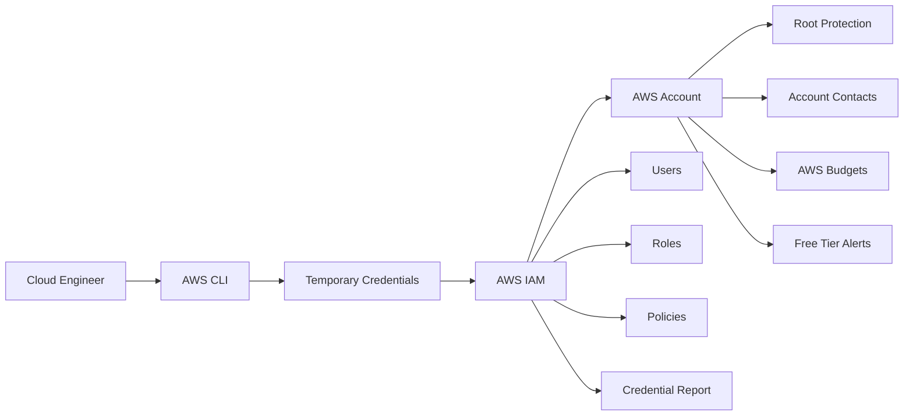

# Lab 01 — AWS Account Security, Identity & Cost Baseline

> Establishing a secure and cost-aware AWS account foundation before deploying cloud infrastructure.

## Scope

- Validate current AWS identity using STS;
- Inventory user, ARN, account, and operational region;
- Verify MFA protection for the root user;
- Confirm that the root user has no access keys;
- Review primary, billing, operations, and security contacts;
- Analyze the current authentication method used for AWS login;
- Identify existing users, groups, roles, and policies;
- Check the IAM credential report;
- Configure AWS Free Tier alerts;
- Create a monthly AWS Budget with alerts for actual and forecasted costs;
- Record evidence without revealing the account ID, full ARN, email, or credentials;
- Produce a checklist covering validation, troubleshooting, and operational conclusions.

AWS recommends using temporary credentials and roles for human access, avoiding permanent access keys whenever possible. It also recommends restricting the root user to tasks that strictly require it and avoiding the creation of access keys for the root account.

The budget will be configured with alerts for both actual and forecasted costs. AWS Budgets monitors and notifies but does not automatically prevent new charges.

## Table of Contents

## Overview

## Business and Operational Scenario

## Objectives

## Architecture

## AWS Services and Technologies

## Skills Demonstrated

## Prerequisites

## Estimated Cost

## Security Considerations

## Repository Structure

## Step 1 — Validate the AWS CLI Session

## Step 2 — Identify the Active AWS Principal

## Step 3 — Review the AWS CLI Authentication Method

## Step 4 — Audit the AWS Account Summary

## Step 5 — Verify Root User Protection

## Step 6 — Review AWS Account Contacts

## Step 7 — Review IAM Users, Groups and Roles

## Step 8 — Generate the IAM Credential Report

## Step 9 — Review IAM Access Keys and MFA Coverage

## Step 10 — Configure AWS Free Tier Alerts

## Step 11 — Create a Monthly AWS Cost Budget

## Step 12 — Validate the Security and Cost Baseline

## Validation Checklist

## Evidence Checklist

## Troubleshooting

## Cleanup

## Security Best Practices

## Operational and Production Relevance

## Key Learnings

## Portfolio Outcomes

## Next Lab

## References
